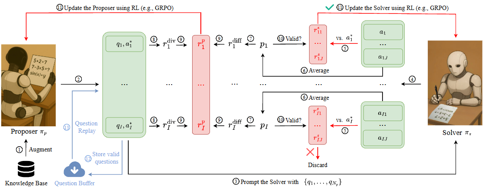

# DWM-arXiv-2026-Better LLM Reasoning via Dual-Play
*论文下载地址：https://arxiv.org/abs/2511.11881v3*

*代码是否开源：未提及*

*分享人：马明晖*

## 一句话总结内容
> 本文提出面向小中型 LLM 的 dual-play 框架 PasoDoble，通过同源 Proposer–Solver 双模型的对抗出题–解题博弈，在无需人工标注的前提下显著增强数学推理能力。

## 一句话总结创新贡献
> 论文构建了一个利用预训练知识库、难度与多样性联合奖励并支持在线/离线两种训练模式的 LLM dual-play 强化学习框架，在多种 Qwen 基座模型和多个数学基准上取得持续增益，从而显著缓解 RLVR 对大规模人工标注数据的依赖。

## 举一个例子说明这篇文章的创新点
> 一个具体的创新在于为 Proposer 设计“难度 + 多样性”联合奖励并配合严格的有效性过滤：Proposer 在知识库文本提示下生成带标准答案的数学题，Solver 对每题独立采样多次作答，据此估计平均通过率 p_i；当 τ_low < p_i < 1 时，将 r_diff = 1.1 − p_i 作为难度奖励（题越难奖励越高，完全做对仍保留小正奖励），同时利用历史题目缓冲区 H 计算与已有题目的 Jaccard 相似度得到多样性得分 r_div，只有在 r_div ≥ τ_div 时才给予 r_p = r_diff + w·r_div 的正向奖励，否则奖励被截断为 0；若 p_i ≤ τ_low 或 r_div < τ_div，则该题被视为无效样本，既不给 Proposer 奖励，也不用于训练 Solver。该机制抑制了 Proposer 通过生成错误答案或高度重复题目进行 reward hacking 的倾向，使训练集中样本自动聚焦于“可解但不易、且形式多样”的区域，从而支撑 Proposer 与 Solver 的长期稳定共进化。

## 框架图

**框架工作流描述**：
> 整体流程如下：1）初始化：选定一个基座 LLM，同构复制为 Proposer 与 Solver，并通过少量监督微调（SFT）冷启动，使二者学会按指定格式给出题目、推理过程与答案。2）知识库构建：收集高质量数学语料（如 MegaMath-Pro-Max），切分为若干知识单元构成 Knowledge Base，用作 Proposer 出题的“知识锚”。3）对抗迭代：每次训练从知识库采样一段文本 k，提示 Proposer 生成 I 个题目–答案对 {(q_i, a_i*)}；随后 Solver 对每个题目独立采样 J 次作答 {a_ij}，并根据是否匹配 Proposer 答案为 Solver 计算逐样本奖励。4）奖励设计：根据多次作答统计平均通过率 p_i，为 Proposer 构造难度奖励 r_diff = 1.1 − p_i，并用历史题目缓冲区 H 计算 Jaccard 相似度得到多样性奖励 r_div；当 p_i > τ_low 且 r_div ≥ τ_div 时，Proposer 获得 r_p = r_diff + w·r_div，否则奖励置零且该题被视为无效；Solver 仅在 τ_low ≤ p_i < 1 的题目上更新，以保证既有有效信号又不过于简单。5）训练范式：在在线 PasoDoble 中，只要当前批次存在有效题目，就使用 GRPO 等策略梯度方法同步更新 Proposer 与 Solver；在离线 PasoDoble 中，先冻结 Solver、仅训练 Proposer 并将筛选后的题目写入 Question Buffer，再冻结 Proposer、利用缓冲区回放若干步更新 Solver，以提升稳定性。6）评估与分析：将训练后的 Solver 在 AIME 2024/2025、AMC、GSM8K、MATH-500、OlympiadBench 等数学基准上进行 zero-shot/少样本评测，并通过消融实验证明知识库、Proposer 训练、多样性奖励以及 dual-play 机制相对于自博弈等变体的作用。

## 本文挑战及已有工作不足
> 1. 在传统 RLVR 框架下，推理能力提升高度依赖人工构造且带标准答案的大规模任务数据，难以扩展到缺乏高质量标注的数学等专业领域
> 2. 双模型对抗训练本身容易振荡或发散，如何在共同更新 Proposer 与 Solver 的同时保持训练稳定并避免性能早期平台化，是框架设计中的关键难点
> 3. 在完全无人工监督的设置中，需要让模型自动生成既语义正确又带可靠答案、同时具备适中难度和足够多样性的题目–答案对，否则训练信号会严重失真
> 4. 将 dual-play / 对抗学习直接迁移到 LLM 时，Proposer 容易通过生成错误或无意义、重复的题目进行 reward hacking，破坏可验证奖励的有效性

## 印象最深刻的点
> 1. 提出面向 LLM 的 dual-play 框架 PasoDoble，将同源的 Proposer 与 Solver 拆分为“出题–解题”两个角色，通过持续对抗博弈在无人工标签条件下显著提升小中型模型的数学推理能力
> 2. 引入知识库驱动的自动出题机制：Proposer 以大规模数学语料为知识锚，自行生成高质量题目及标准答案，从源头降低了对人工设计题目的依赖
> 3. 在多种 Qwen 基座模型和多个数学基准上系统评估，包括在线/离线两种训练范式、随模型规模扩展的收益以及大量消融与训练动态分析，充分验证了各组件设计的必要性与框架的可扩展性
> 4. 围绕难度与多样性构建复合奖励并配合严谨的有效性过滤，将过易、过难或高度重复的题目直接赋零奖励并丢弃，有效抑制 reward hacking、保证可验证训练信号的可靠性

## 对我们的启发
> 1. 消融结果凸显了自生成标签质量控制的重要性，提示在构建类似自博弈 RL 系统时必须配套严格的有效性过滤与知识锚定机制
> 2. 将预训练语料组织为显式知识库，用作自动构造可验证任务的知识源，有望迁移到代码生成、逻辑推理等需要结构化知识支撑的场景
> 3. 基于解题通过率刻画难度、结合题目相似度刻画多样性的复合奖励，为自动 curriculum learning 与覆盖面控制提供了可推广的设计范式
> 4. 在缺乏标注的数据密集型领域，可仿照 PasoDoble 将“任务生成”和“任务求解”拆分为两个专职模型，通过双人博弈式对抗训练构建闭环自监督强化学习体系

## Idea是否好想
> 核心思想是用“出题–解题”的双人博弈结构替代传统 RLVR 中由人类提供任务和标签的角色：Proposer 在知识库文本的约束与启发下生成题目及标准答案，Solver 在这些自动构造的样本上接受强化学习，从而摆脱对人工标注任务–答案对的依赖。为防止 Proposer 随意出题导致奖励失真，框架通过 Solver 的多次作答估计每道题的通过率 p_i，将 p_i 过低的题目视为无效（通常意味着题意不清或答案错误）并直接剔除，而对通过率为 1 的题目也不再用于更新 Solver，以避免训练停留在过于简单的样本；再结合对题目多样性的约束，训练自动聚焦在“适中难度、可解且风格多样”的样本区域，本质上实现了 curriculum learning 与 hard-example mining 的统一。与此同时，作者将 Proposer 与 Solver 解耦建模，并通过在线对抗更新或离线分阶段更新维持两者能力的交替提升，避免了单模型自博弈容易出现的早期平台化乃至退化现象；相关消融实验表明，一旦冻结 Proposer 或移除知识库等关键组件，Solver 的性能上限会明显受限，凸显了强而动态的任务生成器在该框架中的核心地位。

## 是否有开创性
> 与以往“人工构造任务 + RLVR”的训练范式相比，本文主要创新体现在三点：一是提出面向 LLM 推理的 dual-play 框架 PasoDoble，明确定义 Proposer 与 Solver 的分工，通过难度感知的可验证奖励实现稳定的对抗共进化；二是将大规模预训练数学语料组织为知识库，为 Proposer 提供知识锚定，使其在无人工标签的前提下仍能生成高质量题目与标准答案，从根本上降低对监督数据的需求；三是系统整合难度奖励、多样性奖励与有效性过滤，并在在线/离线两种训练范式下，通过与 R-Zero、自博弈和随机奖励等多种基线的详尽消融对比，证明了整体设计的必要性与优势。尽管 dual-play 与自博弈思想在强化学习中已被广泛讨论，这种专门面向 LLM 推理、结合知识库驱动出题与可验证奖励的完整方案，在现有文献中仍具有显著的创新性与参考价值。

## 是否属于热点
> 该工作紧扣当前 LLM 研究的多条热点：其一，面向“无标签/少标签强化学习”（label-free RL），力图在保持性能的同时显著降低人工标注成本；其二，聚焦通过 RLVR、自博弈等手段强化 LLM 在数学等高难度任务上的推理能力；其三，将对抗式与自博弈训练从 AlphaZero、R-Zero、AbsoluteZero 等场景扩展到大规模语言模型；其四，探索在后训练阶段系统重用预训练语料作为知识源，指导自监督强化学习。PasoDoble 将上述方向有机整合，为更大模型和更多任务提供了可复制的实例，因此在当前 LLM 生态中具有较高关注度。

## 其他需要补充的点（可选）
> 1. 实验覆盖多种 Qwen 系列基座模型（如 Qwen2.5-0.5B/1.5B/3B 与 Qwen3-0.6B/1.7B/4B），表明 PasoDoble 可在不同架构与参数规模间复用，具备较强通用性
> 2. 在进入强化学习阶段前，作者采用少量 SFT 进行冷启动，使 Proposer 与 Solver 学会稳定输出题目格式与完整推理过程，这对后续自动出题与可验证评测至关重要
> 3. 论文对 Proposer 行为进行了细粒度分析，包含题目–答案对正确率随训练步数的变化、不同通过率区间样本质量以及对不同模型规模下是否引入知识库的利弊讨论，为在小模型场景下使用外部知识提供了实证参考

## 与其他论文的关联（可选）
> 1. 与 label-free RL：文中对比了基于熵最小化、置信度最大化等无标签强化学习方法，指出这些方法虽不依赖答案标签，却仍需人工构造任务实例，而 PasoDoble 在任务与标签两个层面都尝试实现完全自生成，进一步推进了 label-free RL 的边界
> 2. 与自博弈及 AlphaZero / R-Zero：同样延续了“通过自对弈生成训练数据再反向训练策略”的思路，但这里的对弈形式是“出题–解题”的双人博弈，并显式采用难度与多样性驱动的对抗更新，相比 R-Zero 的非对抗分阶段训练在长程训练稳定性与持续增益上更为突出
> 3. 与 RLVR：PasoDoble 仍属于可验证奖励范式，Solver 的奖励基于答案是否匹配 Proposer 提供的标准答案，不同之处在于题目及答案本身由模型自动生成而非人工标注，从而显著缓解 RLVR 对人工构造任务的依赖

## 还有哪些不足的地方（未来工作）
> 1. 将 PasoDoble 的 dual-play 框架推广到代码生成、逻辑推理、科学计算等其他具有明确可验证标准的任务领域，检验其通用性与潜在局限
> 2. 引入更完善的安全约束与过滤机制，防止 Proposer 在开放域任务中生成带偏见、有害或无意义的样本，同时保持对 Solver 有效的训练价值
> 3. 在更大规模的 LLM（如十亿到百亿参数级别）上系统验证 PasoDoble 的可扩展性，并分析模型规模、训练步数与性能增益之间的关系
> 4. 探索更丰富、更结构化的知识库构建方式，例如引入教材内容、竞赛题官方解析或符号推理库，以进一步提高 Proposer 生成题目与答案的准确性与覆盖度
