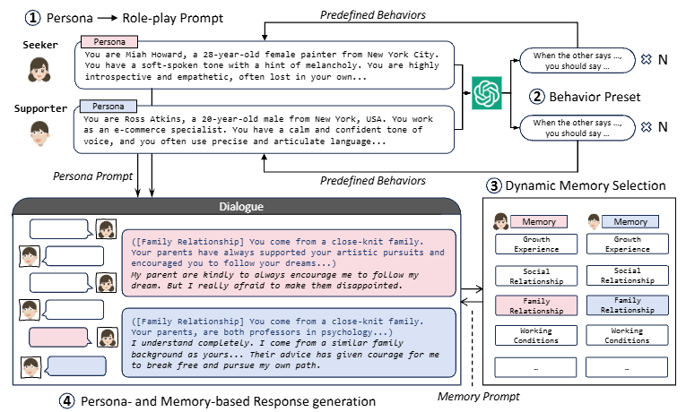

# ED-arXiv-2023-CharacterChat- Learning towards Conversational AI with Personalized Social Support
*论文下载地址：https://arxiv.org/abs/2308.10278*

*代码是否开源：是 https://github.com/morecry/CharacterChat*

*分享人：马明晖*

## 一句话总结内容
> 本文提出基于MBTI人格的社会支持对话（S2Conv）框架及CharacterChat系统，通过人格化支持者与人际匹配机制，为不同性格用户提供个性化情感与社会支持对话。

## 一句话总结创新贡献
> 本文构建MBTI-1024虚拟角色库和MBTI-S2Conv社会支持对话数据集，在Llama2上实现融合人格与记忆的对话模型及人际匹配插件，从而显著提升个性化社会支持效果。

## 举一个例子说明这篇文章的创新点
> 作者基于MBTI 16型人格对ChatGPT进行自指令式“人格分解”，构建包含1024个具有人格设定与记忆档案的MBTI-1024虚拟角色库，再让这些角色两两扮演求助者与支持者自动生成大规模个性化社会支持对话（MBTI-S2Conv），并据此训练“人际匹配插件”，在给定求助者人格时从角色库中调度最合适的支持者，将MBTI人格建模、大模型自博弈数据生成与推荐式人际匹配有机整合为一种新的情感支持对话范式。

## 框架图

**框架工作流描述**：
> 整体流程如图1所示：首先基于MBTI 16种人格原型，通过自指令式人格分解在ChatGPT上扩展得到包含1024个虚拟角色（具有人格设定与记忆）的MBTI-1024 Bank；然后以这些角色作为对话代理随机两两配对，一方充当情感求助者、一方充当支持者，利用包含行为预设和动态记忆机制的改进角色扮演提示自动生成社会支持对话，构成MBTI-S2Conv数据集；接着在Llama2-7B上以MBTI-S2Conv进行定制训练，得到能够结合角色人格与记忆进行应答的S2Conv对话模型；最后基于MBTI-S2Conv中的匹配效果评分训练人际匹配插件，在给定求助者人格时从MBTI-1024 Bank中选出最匹配的支持者，构成由对话模型、匹配插件与角色库协同工作的完整CharacterChat系统，为真实用户提供个性化社会支持。

## 本文挑战及已有工作不足
> 1. 缺乏大规模标注的个性化社会支持语料与人际匹配效果指标，使得量化并学习“匹配”对支持质量的影响具有挑战
> 2. 现实情境下情感支持对话同时面临轻度来访者不愿求助与重度来访者存在安全风险，导致使用意愿与安全性难以兼顾
> 3. 当用户将系统视作“机器人”且缺乏人格匹配感时，易产生心理防御与疏离，难以获得类似“人与人”互动的情感支持体验
> 4. 大模型天然呈现单一稳定人格，难以直接构造规模化、多样化的人格支持者，并为众多虚拟角色维护长期记忆而不引发上下文长度膨胀

## 印象最深刻的点
> 1. 提出社会支持对话（S2Conv）框架，将“匹配合适支持者”提升为系统核心目标，从人际关系视角重塑情感支持对话
> 2. 在Llama2-7B上实现“对话模型 + 匹配插件 + 角色库”的完整CharacterChat系统，实证表明显式匹配机制能显著提升个性化社会支持质量
> 3. 通过改进角色扮演提示与动态记忆机制，自动生成MBTI-S2Conv数据集，并用其系统分析人际人格匹配对支持效果的影响
> 4. 系统性构建MBTI-1024 Bank，从大模型中“蒸馏”出具有人格与记忆配置的大规模虚拟角色库，为人格化对话研究提供可控基础设施

## 对我们的启发
> 1. 多代理场景下的动态记忆机制为缓解长期对话带来的上下文长度问题提供了可推广的工程方案
> 2. 将推荐系统中的“匹配”思想引入对话系统，为个性化AI辅导、心理陪伴等场景提供新的系统设计范式
> 3. 情感支持对话系统应引入人格理论和人际匹配理念，而非仅追求通用“安全有用助手”，以提升真实使用意愿与情感联结
> 4. 可以利用大模型的生成与角色扮演能力，自动构建大规模、多样化人格角色库和对话数据，作为人格研究与应用的通用资源

## Idea是否好想
> 本文的核心思想是将情感支持对话从“单一助手为所有人提供服务”转变为“具有不同人格与记忆的支持者群体 + 人际匹配机制”。在理论层面，作者借用MBTI人格理论，将用户多样化人格与虚拟支持者人格进行显式建模和匹配，以期获得更接近自然人际互动的支持体验；在技术路径上，则充分利用现有大模型（如ChatGPT、Llama2）的自指令与角色扮演能力，自动生成大规模虚拟角色与社会支持对话数据。整体设计大致包含三个层次：1）数据与资源层：构建MBTI-1024角色库和MBTI-S2Conv数据集，缓解个性化社会支持语料匮乏的问题；2）模型层：在Llama2-7B上注入人格和记忆，使对话模型能够在指定角色设定下保持风格一致并持续对话；3）匹配层：通过学习式匹配插件显式建模“求助者—支持者”匹配关系，从而优化支持效果。该工作在“如何让大模型呈现出一个具有人格差异的代理群体”上向前迈出一步，也尝试将心理健康与人格研究紧密嵌入LLM技术框架。不过，其人格建模依赖MBTI标签和生成式构造，角色间人格差异的真实性与心理学效度仍有待更严格的实证检验，而面向真实高风险用户场景的安全与伦理问题在当前摘要中尚未充分展开。

## 是否有开创性
> 创新性主要体现在：1）提出区别于传统ESC的社会支持对话（S2Conv）框架，将个体与特定人格支持者的匹配作为首要设计目标；2）通过MBTI人格分解与自指令生成，从ChatGPT中系统性蒸馏出1024个具备详细人物档案和记忆配置的虚拟角色库，提供了一种构建多人格大模型代理的工程方法；3）设计结合行为预设与动态记忆的角色扮演提示模板，在保证人格一致性的同时缓解长期记忆导致的上下文长度膨胀问题；4）构建MBTI-S2Conv数据集，用于定量分析人际匹配对社会支持效果的影响；5）在S2Conv系统中引入独立的人际匹配插件模型，将“推荐”理念引入情感支持对话，使系统能够主动为不同人格求助者选择更合适的支持者。

## 是否属于热点
> 该工作位于多个研究热点的交叉点：大模型驱动的心理健康与情感支持应用、人格化对话代理构建、基于心理学理论（如MBTI、荣格人格）的LLM行为控制，以及在多代理对话系统中引入推荐/匹配机制。尤其在“LLM + mental health”和“persona-based LLM agents”两个方向上具有较强的代表性和示范意义。

## 其他需要补充的点（可选）
> 1. 代码开源，为心理健康、人格化代理与情感对话等方向的复现、比较和扩展提供了工程基础
> 2. MBTI-S2Conv数据集中包含数量可观且人格多样的社会支持对话，为后续人格化对话研究提供了可复用的基准资源
> 3. 论文指出现有LLM（如ChatGPT、Bard）在MBTI测评下呈现相对稳定的单一人格特征，这直接动机化了多人格虚拟角色库的构建

## 与其他论文的关联（可选）
> 1. 与传统Emotional Support Conversation（ESC）工作：S2Conv将研究重心从仅优化支持话术扩展为“多人格支持者 + 匹配机制 + 对话策略”的综合框架
> 2. 与人格测评与MBTI相关研究：将MBTI作为可操作的人格标签体系，引入大模型虚拟角色构建与人际匹配建模中
> 3. 与多代理和角色扮演大模型及推荐系统：大量使用角色扮演与自博弈式对话生成，并通过人际匹配插件将推荐系统思想融入多轮心理支持场景

## 还有哪些不足的地方（未来工作）
> 1. 论文中未提及明确的未来工作计划或后续研究路线
> 2. 作者在摘要中未详细讨论潜在的真实用户部署、长期随访或伦理规范等扩展方向
