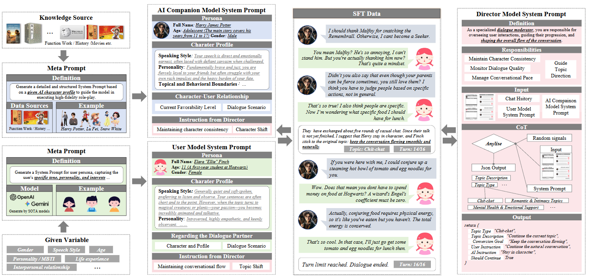

# ED-arXiv-2025-Echo-N1- Affective RL Frontier
*论文下载地址：https://arxiv.org/abs/2512.00344v1*

*代码是否开源：未提及*

*分享人：马明晖*

## 一句话总结内容
> 提出针对主观、情绪化、多轮对话的Echo-N1对齐框架，以“人类化”与“共情”两类生成式奖励模型驱动RL，在不可验证场景中提升情感智能与拟人交互质量。

## 一句话总结创新贡献
> 工作首次系统性表明：在强主观、不可客观验证的情感对话中，借助更具表达力的生成式奖励模型，RL可稳定收敛并显著提升人类化与共情能力。

## 举一个例子说明这篇文章的创新点
> 在同理心对话上以生成式奖励替代标量RM：训练Humanlike Judger（含上下文无关/有关两版）与Empathy Judger，并引入参考锚点——只有当策略回答优于由Gemini-2.5-pro内评为3分的参考响应时才得正奖励，从而稳定优化目标并提升主观对话质量。

## 框架图

**框架工作流描述**：
> 1) 数据与SFT：三代理合成（AI Companion/Director/User）生成多样对话，辅以少量真人双人对话采集与精细清洗；在Qwen3-32B上混合通用与陪伴/角色扮演数据，按课程从短中性到长情感对话逐步训练。2) 奖励模型：人类化RM以“人/机”可判别为目标，构造无上下文、替换末轮、有意打乱等样本抑制风格过拟合与奖励黑客；共情RM用LLM-as-a-judge筛选需共情场景，设安全宪章过滤敏感项，并以Critique-Rewrite生成1–5分候选，保留高质量golden与低分对比。3) RL训练：构建“共情+闲聊”两域数据；共情域采用锚点式奖励（超过3分参考才加分），闲聊域用人类化奖励；结合Best-of-N与成对RM过滤聚焦难例。4) 评测：除通用与静态IQ/EQ外，引入动态EQ套件（如EPM-Q、NEE质性评估）衡量共情、人格一致性与场景鲁棒性。

## 本文挑战及已有工作不足
> 1. 非可验证任务中RL的稳定性与收敛性难以保障
> 2. 强主观性与个体差异使统一、稳定的奖励标注难以成立
> 3. 对外部评审模型与提示设置敏感，带来评估与训练不稳定性
> 4. 标量奖励易被奖励黑客利用，造成表面流畅而语义/情感偏离

## 印象最深刻的点
> 1. 引入参考锚点机制，约束优化方向并提升训练稳定性
> 2. 在深度主观情感对话上构建并运行可行的RL对齐框架
> 3. 提出双重生成式奖励（人类化+共情），通过推理式判决提升奖励表达力与鲁棒性
> 4. 设计动态EQ评测以补足静态基准，覆盖跨场景与人格一致性

## 对我们的启发
> 1. 通过上下文扰动与难例挖掘，提升奖励与数据的稳健性
> 2. 将参考锚点纳入RL，避免无目标的分数堆叠并抑制训练漂移
> 3. 建立动态EQ评测体系，覆盖真实互动场景的情感与人格维度
> 4. 在主观偏好任务中以生成式奖励模型替代标量评分，利用可解释判决与上下文推理

## Idea是否好想
> 该方法以生成式奖励刻画“人类化表达”和“有效共情”的多维准则，并将其纳入RL，使策略在非可验证、强主观场景中仍沿清晰目标优化；关键在于：生成式RM通过链式判决与上下文推理更好捕捉语义与人格一致性，数据稳健化（上下文扰动、难例过滤、安全宪章）降低伪相关与奖励黑客，参考锚点以“超越中等质量”为门槛控向；风险包括对外部强模型的依赖、人格推断偏差传播与多评价器一致性问题。

## 是否有开创性
> 在高度主观的情绪对话中首次展示稳定可行的RL对齐，采用生成式奖励替代标量并配合上下文增强与参考锚点机制，结合动态EQ评测量化情感智能提升。

## 是否属于热点
> 情感智能与共情对话、个性化AI伴侣、主观性对齐、生成式奖励模型、非可验证任务中的强化学习

## 其他需要补充的点（可选）
> 1. Critique-Rewrite仅重写≤3分样本以避免高分过修退化
> 2. 三代理合成中Director每5轮调控话题延续或切换，确保对话自然收束
> 3. SFT基座为Qwen3-32B，训练4个epoch，batch=128，AdamW，lr=1e-5，cosine decay，warmup 0.1

## 与其他论文的关联（可选）
> 1. RLHF（人类偏好标量化）
> 2. 生成式奖励模型（genRM）相关研究
> 3. RLAIF与LLM-as-a-judge范式（外部模型评审的提示敏感与迭代不稳）

## 还有哪些不足的地方（未来工作）
> 1. 开源代码与数据以促进行业复现与基准化
> 2. 扩展多语言与多文化共情评测，监测并缓解跨文化偏见
> 3. 降低对外部模型的依赖，构建自给自足的参考与评审体系
> 4. 上线真实用户闭环的人类在环RL，持续适配个体偏好与情绪漂移
