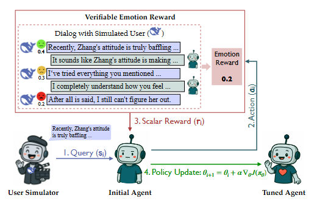

# ED-arXiv-2025-Reinforcement Learning with Verifiable Emotion Rewards for Empathetic Agents
*论文下载地址：https://arxiv.org/abs/2507.03112v1*

*代码是否开源：是 https://github.com/Tencent/DigitalHuman/tree/main/RLVER*

*分享人：马明晖*

## 一句话总结内容
> 提出RLVER框架，结合可验证情绪奖励与用户模拟器开展多轮对话强化学习，显著提升LLM的共情与社会认知能力。

## 一句话总结创新贡献
> 首次将“可验证奖励”的RL范式系统化用于情绪智能对话：以SAGE自洽情感用户模拟器提供确定性情绪分数作为奖励，将7B模型的Sentient-Benchmark从13.3提升至79.2，同时未显著损伤数学与编程能力。

## 举一个例子说明这篇文章的创新点
> 将SAGE产生的确定性情绪分数e_t∈[0,100]直接作为逐轮及终局奖励，并引入格式奖励强制<think>…</think>的显式思考；若格式不合规则奖励归零，从而实现可验证、可复现实验闭环。

## 框架图

**框架工作流描述**：
> 以SAGE为用户模拟环境：为每个对话实例化具有人设、背景、目标与隐意图的情感体。训练中模型基于历史生成回复，模拟器据此更新内部情绪并返回新一轮用户话语；终局情绪分数归一化为回合奖励。策略优化采用PPO与GRPO，对“思考-再输出”模板进行对比；通过熵正则与奖励加权模仿损失抑制过拟合并激励多样化，形成“Heart-in-the-Loop”的闭环训练与评测流程。

## 本文挑战及已有工作不足
> 1. 需在共情专长提升与通用能力保持之间取得平衡
> 2. 缺乏稳定、真实且可扩展的多轮对话环境
> 3. 多轮RL训练易不稳定且存在奖励黑客风险
> 4. 难以为情绪智能设计一致、可验证且可复现的奖励

## 印象最深刻的点
> 1. PPO上限更高，GRPO更稳健且提升更均衡
> 2. 显式思考模板显著提升共情深度与核心洞察；无思考模板更偏向可执行建议
> 3. 在Math500/LiveCodeBench/IFEval等通用能力上基本保持或小幅提升
> 4. 7B开源模型经RL后Sentient-Benchmark由13.3跃升至79.2，逼近Gemini 2.5-Pro等闭源模型

## 对我们的启发
> 1. 通过自洽用户模拟器构建稳定、可扩展、可回放的多轮RL环境
> 2. 结合PPO与GRPO以权衡上限与稳定性，形成鲁棒训练范式
> 3. 以可验证的确定性情绪分数替代黑箱奖励模型，规避奖励黑客与偏差
> 4. 将“思考-再输出”显式化并以格式奖励强制执行，促进高阶共情推理

## Idea是否好想
> 本文将RLVR理念迁移至情绪智能对话：借助SAGE的情绪演化与可解释内心推理输出确定性情绪分数，使奖励可审计、可复制，避免学习到奖励模型偏差。通过强制<think>链路，结构化策略空间，利于稳定优化与高阶策略涌现。实验系统比较是否显式思考、PPO与GRPO、环境难度等因素对核心能力谱系的影响，给出可操作的训练与环境设计建议；结果表明，适度环境与显式思考在不牺牲通用能力的前提下显著提升共情质量与对用户核心诉求的识别。

## 是否有开创性
> 在多轮共情对话中实现“可验证情绪奖励”的端到端RL框架；以格式奖励强制显式思考；以自洽情感用户模拟器同时充当环境与奖励源并实现稳健扩展；系统比较PPO/GRPO与思考模板对能力谱系的塑形作用。

## 是否属于热点
> 面向情绪智能与社会认知的LLM对齐、可验证奖励的强化学习、用户模拟器驱动的对话RL、链式思考的规范化与安全训练、轻量模型对齐以媲美大模型。

## 其他需要补充的点（可选）
> 1. 开放代码、检查点、提示词与环境脚本，便于复现
> 2. 提出Heart-in-the-Loop闭环，将情绪反馈直接纳入训练迭代
> 3. 默认以DeepSeek-V3作为情感体与评测代理，构建覆盖8类目标的500个场景；对话最长10轮，达成目标或触发阈值即终止

## 与其他论文的关联（可选）
> 1. 继承RLVR在数学、编程、搜索等任务的成功，扩展至对话与情绪智能
> 2. 建立在SAGE（Zhang et al., 2025a）之上，将其从评测器转化为训练环境与奖励源
> 3. 与PPO（Schulman et al., 2017）与GRPO（Shao et al., 2024）结合，比较稳定性与上限

## 还有哪些不足的地方（未来工作）
> 1. 扩展多代理、多人格与跨文化/多语言情感体，提升泛化与公平性
> 2. 研究在线RL与长期交互记忆，支持持续关系维护与个性化共情
> 3. 引入人类在环或半合成-人类混合奖励以校准情绪分数的外部效度
> 4. 加强安全与伦理对齐（避免过度劝导、情感操控）并开展鲁棒性与对抗评测
