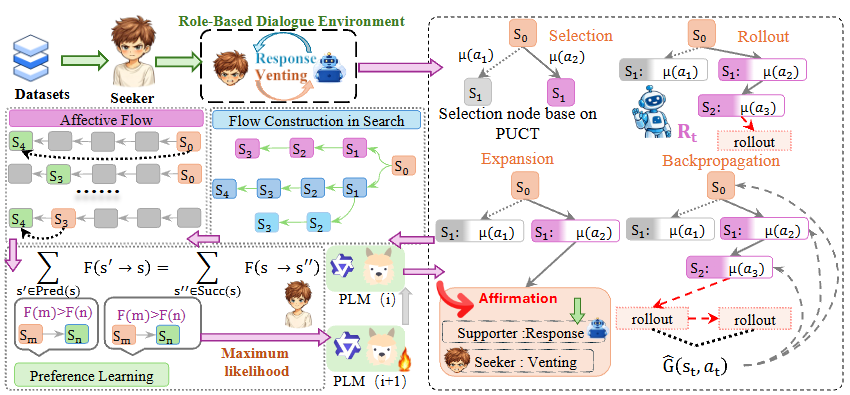

# ED-arXiv-2026-Affective Flow Language Model for Emotional Support Conversation
*论文下载地址：https://arxiv.org/abs/2602.08826v1*

*代码是否开源：是 https://github.com/chzou25-lgtm/AffectiveFlow*

*分享人：马明晖*

## 一句话总结内容
> AFlow通过搜索蒸馏与对话前缀的“情感流”监督，将子路径级流量平衡与偏好优化结合，在多轮情感支持对话中实现策略一致性与细粒度对齐。

## 一句话总结创新贡献
> 本文将GFlowNet式流守恒引入LLM偏好对齐，提出在子路径上平衡流量的AFPO以向中间状态稠密回传偏好信号，并在ESC任务上超越GPT-4o与Claude-3.5等强基线。

## 举一个例子说明这篇文章的创新点
> 以“探索→安慰→行动”的三步子路径为例，AFlow不再仅以终局奖励训练最后一步，而是将搜索得到的高分轨迹分解为前缀流差与策略对数概率之差的匹配约束，使“行动”偏好被一致回传至前两步前缀，促成从安慰到行动的平滑过渡与更高后续收益。

## 框架图

**框架工作流描述**：
> 整体流程分三阶段：1) 角色分离的对话环境+MCTS构造信号：以求助者/支持者/评估者三代理生成搜索树，按同理心、信息质量、自然度、策略效能四维打分并聚合，得到bQ(s)、bQ(s,a)等监督；2) AFPO训练：将状态流定义为F(s)=bQ(s)·Vϕ(s)，以边流F(si→si+1)=F(si)·πθ(ai|si)构建子路径级流量平衡损失，使log流差与策略对数概率和一致，同时用边级排序损失强制Vϕ(st,·)的偏好顺序与搜索估计一致；3) 轻量推理：在当前状态下选取Top-K策略候选，以score=logπθ+Vϕ打分择优，再由支持者模型条件生成回复。

## 本文挑战及已有工作不足
> 1. 上下文敏感性不足：难以随对话进展动态把握支持时机与力度
> 2. 信用分配困难：偏好信号多停留在响应或终局层面，难为中间策略决策提供明确监督
> 3. 情感动态缺失：训练信号未显式刻画细粒度情感变化，导致长程衔接不稳

## 印象最深刻的点
> 1. MCTS+角色分离环境提供心理学维度的细粒度监督，O(T^2)前缀信号提升数据效率
> 2. 提出子路径级流量平衡，将终局偏好稠密回传到所有前缀状态，显著强化长程信用分配
> 3. 跨骨干与跨评估器表现稳定，回报曲线平稳，探索/安慰/行动三个阶段均衡且行动阶段最稳健
> 4. 在Qwen-2.5等开源骨干上取得超过GPT-4o与Claude-3.5的ESC主要指标表现

## 对我们的启发
> 1. 在推理期将策略先验与学习到的价值相加打分，平衡探索与偏好导向
> 2. 以子路径一致性替代纯响应级比较（如DPO），减少对负例采样与局部偏好的依赖
> 3. 通过角色分离与MCTS获取更贴近心理学规范的过程级奖励，优于仅依赖终局稀疏信号
> 4. 以GFlowNet式流守恒为LLM偏好对齐提供结构化过程监督，兼顾前缀密度与全局一致性

## Idea是否好想
> 方法直击ESC的两大难点——长程策略衔接与情感动态跟踪。AFPO将终局偏好一致回传到前缀，弥补DPO/对话级RLHF在中间决策监督稀疏的问题，并与MCTS结合提升搜索的方向性。但其依赖LLM奖励器与模拟环境，可能引入分布漂移与模拟偏差；MCTS与O(T^2)子路径约束增加计算开销；策略类别合并为8类，细粒度与可扩展性仍有限；真实用户场景的安全、伦理与跨文化适配仍需系统评估。

## 是否有开创性
> 首创性地在多轮情感支持任务中将GFlowNet式流守恒引入偏好优化，提出子路径级流量平衡目标，使对数域中的前缀流与末端偏好精确匹配；区别于传统响应级偏好学习，它提供跨前缀的稠密监督与一致的价值传播，并以角色分离的MCTS构建心理学维度的即时奖励，形成“搜索蒸馏—流平衡—值引导”的一体化对齐框架。

## 是否属于热点
> 面向心理健康场景的LLM对齐、过程监督与搜索蒸馏的偏好优化、GFlowNet+LLM的长程信用分配、MCTS驱动的多代理对话优化、策略一致性与情感动态建模。

## 其他需要补充的点（可选）
> 1. 推理期从Top-K策略集中以logπθ+Vϕ打分选优，兼顾校准与偏好引导
> 2. MCTS滚动深度L=3，早停时回报清零避免偏好泄漏，选择策略混合先验软最大化与均匀探索
> 3. 奖励由同理心、信息质量、自然度、策略效能四维加权求和，权重(0.1, 0.1, 0.1, 0.2)并以常数2.5归一化

## 与其他论文的关联（可选）
> 1. 借鉴GFlowNet的流守恒，但目标由采样终物体转为对话前缀的情感流建模，更贴合对话策略对齐
> 2. 相较DPO等响应级偏好学习，AFlow在子路径上施加流量平衡，提供前缀级稠密监督与长程信用分配
> 3. 不同于RLHF/HR等方法，依赖角色分离MCTS生成细粒度过程信号，减轻终局稀疏奖励对训练稳定性的制约

## 还有哪些不足的地方（未来工作）
> 1. 扩展至更细粒度、可组合的策略空间，探索自适应策略库与自动归并
> 2. 引入人类专家在环的奖励与校准，降低模拟环境与奖励器偏差
> 3. 在真实场景开展长期的安全性、伦理性与疗效评估，覆盖不同文化与语言人群
> 4. 优化搜索与训练效率（学习型启发、剪枝、子路径采样），降低O(T^2)开销
