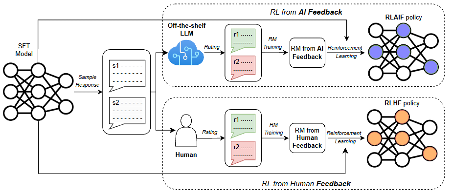

# RLHF-ICML-2024-RLAIF vs. RLHF- Scaling Reinforcement Learning from Human Feedback with AI Feedback
*论文下载地址：https://arxiv.org/abs/2309.00267v3*

*代码是否开源：未提及*

*分享人：马明晖*

## 一句话总结内容
> 本文系统对比RLHF与RLAIF，在摘要、助人与安全对话上验证RLAIF可匹敌乃至优于RLHF，并提出免奖励模型的直接RLAIF（d-RLAIF）。

## 一句话总结创新贡献
> 工作提供RLAIF与RLHF的正面对比证据，提出以LLM直接打分作为奖励的d-RLAIF，验证同尺寸/同检查点下的自我改进，并系统分析AI偏好标注的对齐技巧与成本可扩展性。

## 举一个例子说明这篇文章的创新点
> 直接RLAIF（d-RLAIF）：在RL阶段直接提示通用LLM对生成按1–10分评分，取打分token概率的期望并归一到[-1,1]作为奖励，从而绕过奖励模型训练并缓解奖励“陈旧”，在摘要与助人对话中与或优于经典RLAIF；同时在助人对话中用同一模型检查点既作策略又作打分器，仍实现严格意义的自我改进。

## 框架图

**框架工作流描述**：
> 1) AI偏好标注：通过前导说明与可选少样例提示，请LLM比较成对候选，读取“1/2”对数概率并softmax成软偏好；采用双向展示抵消位置偏差，并用两步提示引导链式思维提升与人类偏好一致性。2) 经典RLAIF：用AI软偏好训练奖励模型（以RM打分softmax配交叉熵拟合软标签），再用REINFORCE优化策略。3) d-RLAIF：在RL中直接让LLM打1–10分，取期望并归一化为奖励，无需RM训练且更抗分布漂移导致的陈旧。4) 评估：以人类偏好胜率与安全率为主，并用AI-人类一致性衡量标注质量；做长度偏置事后控制；比较提示策略与标注LLM规模对对齐的影响。

## 本文挑战及已有工作不足
> 1. 奖励模型随策略分布漂移而“陈旧”导致性能下滑
> 2. 高质量人类偏好标注成本高且难以扩展
> 3. LLM标注对位置与提示敏感，易引入系统性偏差
> 4. AI偏好与人类偏好的对齐度有限且具任务依赖性

## 印象最深刻的点
> 1. 正面对比显示RLAIF与RLHF总体胜率接近，未见显著差异
> 2. 在助人对话中实现严格自我改进：策略与打分器为同一检查点仍优于SFT
> 3. 在安全对话上RLAIF安全率达88%，显著高于RLHF的76%与SFT的64%
> 4. 提出d-RLAIF直接用LLM打分为奖励，在摘要任务优于同尺寸运行的经典RLAIF（74% vs 68%）

## 对我们的启发
> 1. 使用软标签与双向展示缓解位置偏差并提升信号利用率
> 2. 以AI偏好替代或补充昂贵的人类标注，提升对齐训练可扩展性
> 3. 在资源受限场景采用d-RLAIF，避免奖励模型训练与陈旧问题
> 4. 通过链式思维提示提高AI标注与人类偏好的一致性

## Idea是否好想
> 论文以人类评测证明RLAIF可替代RLHF，并以d-RLAIF把AI偏好直接嵌入RL循环，从根源上降低训练与维护奖励模型的成本与失配风险；方法强调软偏好、提示工程与偏差控制，并通过缩放实验揭示标注器能力与对齐度的正相关；结果在安全性上优势明显，且在同尺寸与同检查点条件下实现自我改进，兼具实用价值与理论意义。

## 是否有开创性
> 相较既有RLAIF/Constitutional AI工作，本文提供与RLHF的正面对照，提出无需奖励模型的d-RLAIF，验证同尺寸与严格同检查点的自我改进，并系统考察提示策略与标注器规模对对齐的影响。

## 是否属于热点
> 大模型对齐与强化学习、以AI反馈替代人类反馈的可扩展方案、链式思维辅助评估与奖励生成、无需奖励模型的直接RL框架。

## 其他需要补充的点（可选）
> 1. 尝试混合人类与AI反馈未能超过仅用人类反馈
> 2. 在摘要任务对长度偏置做了事后控制，RLAIF与RLHF仍优于SFT
> 3. 奖励与价值网络由SFT初始化，RL采用带基线的REINFORCE而非PPO

## 与其他论文的关联（可选）
> 1. Rafailov et al., 2024（DPO）：以分类损失替代RL的稳定高效对齐方法
> 2. Bai et al., 2022b：RLAIF与Constitutional AI的早期探索
> 3. Stiennon et al., 2020：以人类偏好训练奖励模型并用于摘要的RLHF开创性工作

## 还有哪些不足的地方（未来工作）
> 1. 系统研究人类与AI反馈的混合与自适应加权机制以提升稳健泛化
> 2. 改进提示与解码策略（抗位置偏差、任务自适应前导说明）以进一步提升对齐
> 3. 在更多任务与数据分布上验证d-RLAIF与自我改进的适用范围与边界
> 4. 探索在线迭代的RLAIF/d-RLAIF以持续缓解分布漂移与奖励陈旧
