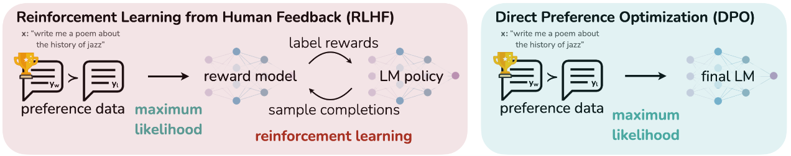

# RLHF-NIPS-2023-Direct Preference Optimization- Your Language Model is Secretly a Reward Model
*论文下载地址：https://arxiv.org/abs/2305.18290*

*代码是否开源：未提及*

*分享人：马明晖*

## 一句话总结内容
> 提出DPO，用偏好数据对策略进行二分类交叉熵训练，在KL约束下直接得到最优策略，无需显式奖励建模与强化学习即可实现对齐与可控。

## 一句话总结创新贡献
> 将带KL约束的奖励最大化重参数化为对策略的直接优化，给出从奖励到最优策略的闭式映射并去除RL训练环，显著简化并稳定偏好微调流程。

## 举一个例子说明这篇文章的创新点
> 采用Bradley–Terry偏好模型，将奖励重参数化为r(x,y)=β·log(π(y|x)/πref(y|x))，使偏好似然仅依赖策略与参考策略的对数比，从而用二元交叉熵直接优化π，无需PPO式在线采样与配分常数估计。

## 框架图

**框架工作流描述**：
> 1) 用参考策略πref对每个提示采样两条回复并收集人类偏好，得到(yw, yl)；2) 以DPO损失最小化LDPO，提升yw相对yl的对数几率并按样本难度动态加权；3) 训练得到满足KL约束的策略πθ，全程不需单独训练奖励模型或进行RL回合调参。

## 本文挑战及已有工作不足
> 1. 传统RLHF流程冗长且不稳定，需先训练奖励模型再用PPO等RL优化策略
> 2. 离散生成目标不可微导致高方差估计与超参数敏感
> 3. 偏好模型的等价类与可辨识性带来建模与优化难点
> 4. KL约束下的配分函数估计昂贵，易引发训练不稳与模式坍塌

## 印象最深刻的点
> 1. 给出从奖励到最优策略的闭式形式并在偏好模型下抵消配分项
> 2. 将RLHF目标精确转化为简单的BCE损失，彻底去除RL训练环
> 3. 在摘要与单轮对话等任务上达到或超过PPO，且对采样温度更鲁棒
> 4. 提供理论分析：等价类、不损失可表示性，以及与控制即推断的联系

## 对我们的启发
> 1. 通过变量替换在策略空间直接优化偏好，减少流水线组件与误差传递
> 2. 利用闭式映射与等价类约束缓解不可辨识性并提升稳定性
> 3. 在大模型场景优先采用无需在线采样的对齐方法以降低成本
> 4. 用参考策略与对数几率刻画隐式奖励，可迁移到排序或多项偏好模型

## Idea是否好想
> 核心思想是将带KL约束的奖励最大化重写为策略的函数，使Bradley–Terry偏好概率仅依赖策略与参考策略的对数比，进而用BCE拟合偏好即可得到对应的最优策略；由此避免显式奖励建模、价值估计与基于采样的PPO更新，训练更稳定、成本更低；理论上通过等价类与投影证明该重参数化不损失可表示性，并解释PPO中基线与归一化项导致的不稳来源；潜在局限包括对BT/Plackett–Luce假设的依赖、对β与参考策略选择的敏感性、在多属性或多轮偏好上的扩展，以及复合目标与安全约束的整合。

## 是否有开创性
> 以策略重参数化实现偏好似然最大化，绕开显式奖励与RL优化；提出逐样本的重要性加权并给出理论保证，使RLHF目标可用标准监督学习一次性求解。

## 是否属于热点
> 大模型对齐与偏好学习的轻量化、稳定化训练范式，替代PPO的无RL对齐方法。

## 其他需要补充的点（可选）
> 1. 从控制即推断视角解析PPO不稳定性与基线项作用
> 2. 无SFT参考时可先对偏好正例做MLE以缓解分布偏移
> 3. 形式上与Plackett–Luce兼容，并给出等价类与投影的理论刻画

## 与其他论文的关联（可选）
> 1. PPO-based RLHF：传统两阶段奖励学习+RL优化，DPO以监督式BCE直接替代
> 2. REINFORCE与Actor-Critic：需高方差估计与基线，DPO避免此类不稳因素
> 3. Bradley–Terry/Plackett–Luce偏好模型：DPO在其假设下重参数化偏好似然

## 还有哪些不足的地方（未来工作）
> 1. 自适应参考策略与动态β调度以提升泛化与稳健性
> 2. 在线偏好收集与RLAIF场景下的稳定训练策略
> 3. 扩展到多属性、多目标与层级偏好（如同时优化有用性与安全性）
> 4. 支持多候选排序（Plackett–Luce全序）与成对之外的复杂偏好格式
