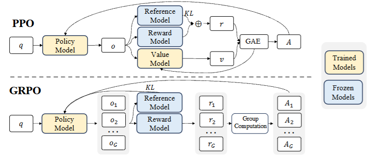

# RLHF-arXiv-2024-DeepSeekMath- Pushing the Limits of Mathematical Reasoning in Open Language Models
*论文下载地址：https://arxiv.org/abs/2402.03300v3*

*代码是否开源：是 https://github.com/deepseek-ai/DeepSeek-Math*

*分享人：马明晖*

## 一句话总结内容
> DeepSeekMath 通过构建大规模高质量数学语料并引入高效的GRPO强化学习，在7B开源模型上将数学推理能力推进至接近GPT-4/Gemini-Ultra的水平。

## 一句话总结创新贡献
> 构建120B数学语料与统一对齐范式，并提出无需价值网络的Group Relative Policy Optimization（GRPO），在显著降低训练成本的同时提升数学推理表现。

## 举一个例子说明这篇文章的创新点
> 在GRPO中，对同一问题用旧策略一次采样G个答案，以其平均奖励为基线计算优势，免去与策略同规模的价值网络训练；在仅用部分英文SFT数据进行RL的设置下，MATH由46.8%升至51.7%，GSM8K由82.9%升至88.2%。

## 框架图

**框架工作流描述**：
> 整体流程：1) 数据阶段：从Common Crawl经fastText分类与迭代域挖掘、URL路径标注与去重/去污染，构建含英/中文的120B数学token语料；2) 预训练阶段：以DeepSeek-Coder-Base-v1.5 7B初始化，继续训练500B tokens，数据配比为数学56%、AlgebraicStack 4%、arXiv 10%、GitHub代码20%、通用自然语言10%；3) 指令微调：构建约776K中英文SFT数据，统一CoT/PoT与工具集成格式，得到DeepSeekMath-Instruct；4) 强化学习：以GRPO替代PPO的价值网络，使用组内相对奖励与参考模型KL约束优化策略，得到DeepSeekMath-RL；5) 评测：在GSM8K、MATH、SAT、OCW、MMLU-STEM、CMATH、Gaokao等基准上评估CoT与工具设置，并在miniF2F检验非正式到正式证明与通用推理/代码能力。

## 本文挑战及已有工作不足
> 1. 多语种（尤其中文）能力易受英语偏置抑制，提升困难
> 2. 数学推理链长且对精确计算敏感，通用LLM难以稳定掌握
> 3. 高质量且去污染的数学大语料稀缺，需从嘈杂网页中精准筛选
> 4. PPO成本高且价值网络在末token奖励下难以稳定训练

## 印象最深刻的点
> 1. 构建120B数学token的高质量语料，规模与效果均超越现有开源数据集
> 2. 提出GRPO，移除价值网络，以组内相对奖励为基线，显著降低内存与算力开销
> 3. 7B模型在不使用外部工具与投票的Top1设置下，MATH达51.7%；自一致性64采样可至60.9%
> 4. DeepSeekMath-Base 7B在MATH上超过Minerva 540B等更大模型，显示数据与训练优于纯参数规模

## 对我们的启发
> 1. 以组内相对奖励为基线的RL可扩展到偏好对比、过程监督与程序化奖励
> 2. 从统一范式看RFT/DPO/PPO/GRPO皆属RL变体，可据此设计更高效的对齐方法
> 3. 先代码后数学的训练顺序有助于复杂推理，可推广至其他逻辑密集任务
> 4. 迭代式域发现与URL路径标注的数据挖掘管线可迁移至代码等专业领域

## Idea是否好想
> 论文以“高质量数据×高效RL”为双轮：基于Common Crawl构建多语种120B数学语料，经fastText筛选、域级挖掘与URL标注迭代提纯并严格去污染；训练上以代码优先初始化，继续大规模数学预训练，SFT统一CoT/PoT/工具格式，最终以GRPO进行高效RL。GRPO用组内相对奖励替代价值网络，并配合参考模型KL，缓解末token奖励下的值函数难学与资源开销。实证表明，小参数模型在优质数据与轻量RL下可逼近闭源旗舰模型，同时带动中文与通用推理能力提升。

## 是否有开创性
> 提出无需价值网络的GRPO，以组内相对奖励估计优势，显著降低RL成本；构建迄今最大的开源网络数学语料（120B），验证其对中英文数学推理的全面提升；从统一范式连接RFT、DPO、PPO与GRPO，系统对比在线/离线、结果/过程监督与单轮/迭代RL；实证支持“先代码、后数学”的训练路径，并发现单纯增加arXiv论文对数学基准提升有限。

## 是否属于热点
> 小模型逼近闭源的数学推理、去价值网络的轻量RL、超大规模高质量数学数据工程、工具增强推理与形式化证明、对齐算法的统一范式与资源效率。

## 其他需要补充的点（可选）
> 1. 观察：单独增加arXiv数据对数学基准的提升有限
> 2. 严格去污染：对基准10-gram精确匹配过滤，短文本3-gram匹配以避免泄漏
> 3. 数据配比：数学56%、AlgebraicStack 4%、arXiv 10%、GitHub代码20%、通用自然语言10%

## 与其他论文的关联（可选）
> 1. Minerva（Lewkowycz et al., 2022）：闭源基座+数学继续训练，本文7B在MATH上超越其540B结果
> 2. PPO（Schulman et al., 2017）、DPO（Rafailov et al., 2023）、RFT（Yuan et al., 2023）：本文给出统一范式并以GRPO提升效率
> 3. OpenWebMath（Paster et al., 2023）与Proof-Pile-2（Azerbayev et al., 2023）：本文数据规模与质量均显著超越

## 还有哪些不足的地方（未来工作）
> 1. 融合过程监督与结果监督的混合奖励，结合可执行校验提升奖励可靠性
> 2. 将GRPO推广到更广泛的对齐任务（安全、对话、长上下文），并研究不同组大小与抽样策略
> 3. 扩展迭代挖掘到更多语种与子领域并优化比例配比
> 4. 探索在线与迭代式RL训练，结合自反思/自修正循环增强稳健性
