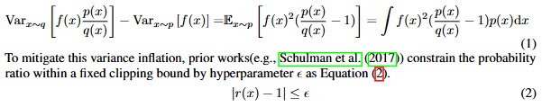

# RLHF-arXiv-2025-DCPO- Dynamic Clipping Policy Optimization
*论文下载地址：https://arxiv.org/abs/2509.02333v2*

*代码是否开源：是 https://github.com/lime-RL/DCPO*

*分享人：马明晖*

## 一句话总结内容
> DCPO以动态自适应剪切与平滑累计优势标准化，在RLVR中显著提升LLM的推理表现与数据利用率。

## 一句话总结创新贡献
> 提出概率依赖的动态剪切（DAC）与平滑累计优势标准化（SAS），结合Only-Token-Mean损失，在降低剪切率与提升响应利用率的同时刷新多项数学基准。

## 举一个例子说明这篇文章的创新点
> 动态自适应剪切：对重要性比率r(x)施加概率依赖的约束|(r(x)−1)p(x)| ≤ ε，推导出随旧策略概率q(x)变化的自适应上下界：0.5 + 0.5*sqrt(max(1−4ε_low/q(x),0)) ≤ r(x) ≤ 0.5 + 0.5*sqrt(1+4ε_high/q(x))。低概率token获得更宽松的更新区间，从而增强探索；优势标准化：将同一提示在训练全过程累计的奖励分布用于标准化，并与当前步的标准化结果做动态加权，最后取绝对值更小者作为训练优势，避免同奖零梯度与方差抖动；OTM损失：仅在单条响应内按token均值聚合，避免批级平均稀释响应间已标准化的相对优势。

## 框架图

**框架工作流描述**：
> 1) 在RLVR框架下为每个提示采样多条响应并计算可验证奖励；2) 维护同一提示跨训练步骤的奖励统计，计算当前步与累计的标准化优势，按步数平滑加权并取绝对值较小者作为训练信号；3) 在token级计算重要性比r_i,t，依据旧策略概率q(x)应用动态自适应剪切，低概率token享受更宽松边界；4) 使用Only-Token-Mean损失：仅在单条响应内部对token损失取均值，不做批级平均；5) 不显式加入KL约束；6) 迭代优化策略，并监控TCR（被剪切token占比）与RUR（非零优势响应占比）评估效率与稳定性；7) 在MATH500、AMC23、AIME24、AIME25上以Avg@1与Avg@32评估。

## 本文挑战及已有工作不足
> 1. 序列级剪切与动态采样易丢失信息，数据利用率偏低
> 2. 重要性采样带来高方差与跨步优势抖动，TCR波动显著
> 3. 同奖标准化导致优势为零，出现零梯度使大量响应无法更新
> 4. 统一或固定剪切边界抑制低概率token探索并引发熵塌缩

## 印象最深刻的点
> 1. TCR更低且更稳定，训练效率较DAPO至少提升一倍
> 2. RUR平均约71.8%，较GRPO提升约28个百分点
> 3. 在AIME25（Qwen2.5-14B）取得20.0/18.2与23.3/19.0等结果，显著超越GRPO(13.3/10.5)并超过DAPO与GSPO
> 4. 在AIME24（Qwen2.5-Math-7B）达成Avg@1/Avg@32为46.7/38.8，优于GRPO(36.7/32.1)、DAPO(36.7/31.6)、GSPO(40.0/34.9)

## 对我们的启发
> 1. 将剪切边界做成旧策略概率的自适应函数，以兼顾方差控制与探索
> 2. 以TCR、RUR作为过程指标，提升RL对齐训练的可解释性与可监控性
> 3. 跨步累计统计与平滑融合可缓解同奖零梯度与步间抖动
> 4. 避免批级平均以保留响应级相对优势结构，减少优势稀释

## Idea是否好想
> DCPO从重要性采样的方差控制出发，用概率依赖的剪切边界定向放宽低概率token，兼顾稳定与探索；SAS将累计与当前分布平滑融合，化解同奖零梯度与跨步抖动，提升响应利用率与样本效率；OTM避免批级平均破坏相对优势。三者协同带来更稳的TCR、更高的RUR与下游实证增益。潜在风险在于无KL约束可能引发策略漂移（需依赖剪切与边界上限抑制），跨步累计统计的实现与存储开销较高；在不可验证或多维复杂奖励上的泛化仍待验证。

## 是否有开创性
> 概率依赖的动态剪切边界（闭式解，低概率更宽松）；跨步累计的平滑优势标准化并取幅度较小者以稳健训练；仅在单响应内部求均值的OTM损失以保持优势结构；以TCR与RUR为过程诊断指标。

## 是否属于热点
> 面向LLM推理增强的RL（RLVR/RLHF）策略优化，聚焦稳定训练与样本效率，在高难数学推理基准中的鲁棒性与探索能力。

## 其他需要补充的点（可选）
> 1. 在四个Qwen2.5家族模型上与GRPO、DAPO、GSPO对比，验证可迁移性
> 2. 对正负优势统一设置最大剪切上限为10，防止过大边界导致过拟合或不稳定
> 3. 数据集为DAPO-Math-17K与MATH(3-5级)合并约25k题，统一采用Qwen-Math模板

## 与其他论文的关联（可选）
> 1. DAPO：Clip-Higher与动态采样部分奏效但效率低，DCPO避免丢弃响应并提升RUR
> 2. GSPO：序列级剪切丢失信息且TCR更高，DCPO保留更多有效token
> 3. GRPO：固定或非对称剪切易致熵塌缩与零优势，DCPO以DAC与SAS缓解

## 还有哪些不足的地方（未来工作）
> 1. 与KL控制或信任域约束结合，权衡稳定性与探索
> 2. 在线自适应调整ε_low与ε_high等超参
> 3. 将DCPO扩展到代码生成与语义推理等更多可验证奖励任务
> 4. 在含噪或部分可验证奖励下开展鲁棒性与方差-偏差理论分析
