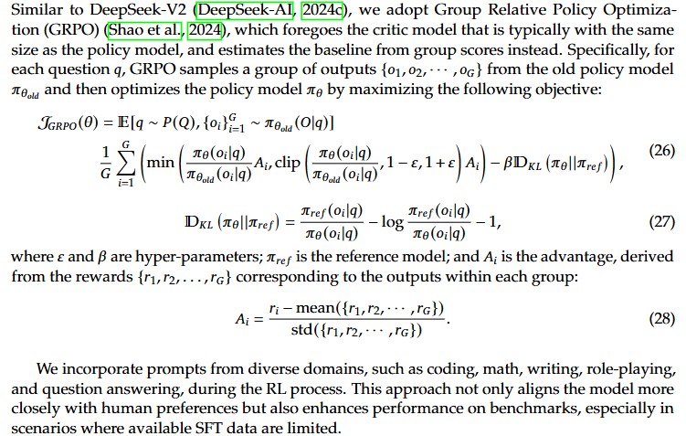

# RLHF-arXiv-2025-DeepSeek-V3 Technical Report
*论文下载地址：https://arxiv.org/abs/2412.19437v2*

*代码是否开源：是 https://github.com/deepseek-ai/DeepSeek-V3*

*分享人：马明晖*

## 一句话总结内容
> DeepSeek-V3 是一款 671B 参数（每 token 激活 37B）的开源 MoE 大模型，融合 MLA 与 DeepSeekMoE，并提出免辅助损失的负载均衡与保持因果链的多 token 预测目标，配合 FP8 与 DualPi。

## 一句话总结创新贡献
> 在超大规模上系统验证 FP8 混合精度训练可行性，提出无需辅助损失的 MoE 负载均衡与保持因果链的多 token 预测目标，在显著压降训练/推理成本的同时提升通用、代码与数学能力。

## 举一个例子说明这篇文章的创新点
> 在路由阶段为每个专家引入动态偏置 b_i，根据步级批次统计的过载/欠载以速度参数 γ 自适应增减；偏置仅用于 Top-K 选择而不改变门控值，从而在几乎无需辅助损失的前提下实现稳定、全程无丢 token 的负载均衡训练。

## 公式

**工作流描述**：
> 训练流程：1) 基座采用 Transformer + MLA（压缩 KV cache 与 Query 激活）与 DeepSeekMoE（细粒度专家+共享专家）；2) 以 FP8 混合精度在 2048×H800 集群上预训练 14.8T 高质量多样化数据，使用 16 路流水线并行、跨 8 节点的 64 路专家并行与 ZeRO-1 数据并行；3) 借助 DualPipe 将前/反向计算与 All-to-All、PP 通信深度重叠，并配合节点受限路由与定制 All-to-All 内核，基本隐藏通信开销；4) 分两阶段将上下文从 32K 扩展至 128K；5) 后训练阶段执行 SFT 与 RL（含奖励模型与 GRPO），并从 DeepSeek-R1 蒸馏“验证—反思”的长链路推理模式，同时控制输出风格与长度。推理部署：MLA 降低 KV 开销，MTP 模块可在推理时丢弃或用于推测解码以加速；通过部署侧策略保证专家负载均衡，无需丢 token。

## 本文挑战及已有工作不足
> 1. FP8 低精度训练的稳定性与精度保真验证
> 2. MoE 专家负载不均衡与路由坍塌，导致跨节点通信低效
> 3. 超大规模下内存与激活开销高，尤其 KV cache 过大
> 4. 跨节点 All-to-All 引发计算/通信 1:1 失衡与带宽瓶颈

## 印象最深刻的点
> 1. FP8 在超大规模模型上的首次系统性落地与验证
> 2. 671B 总参数、每 token 仅激活 37B，兼顾能力与推理成本
> 3. 在开放模型中表现领先，综合接近 GPT-4o/Claude-3.5-Sonnet
> 4. 预训练总计约 2.788M H800 GPU 小时（按 $2/h 约 $5.576M），性价比高

## 对我们的启发
> 1. 对比并改进基于辅助损失的负载均衡（如 GShard/Switch Transformers）
> 2. 推测解码与 KV 压缩等高效推理技术的最新进展
> 3. 沿用并强化 DeepSeek-V2 的 MLA 与 DeepSeekMoE 设计
> 4. 多 token 预测受 Gloeckle 等工作启发并融入 EAGLE 的因果链思想

## Idea是否好想
> 论文以“算法—系统—硬件”协同优化为主线：模型侧用 MLA 压降内存与激活、以动态偏置路由实现免辅助损失的专家负载均衡；系统侧以 DualPipe 深度重叠计算与 All-to-All/PP 通信并定制内核适配 IB/NVLink 拓扑；数值侧采用 FP8 全链路训练与低精度通信，显著缓解超大规模 MoE 的通信与成本瓶颈；同时引入保持因果链的 MTP 目标，提供更密集训练信号并可复用于推测解码，从而在有限预算下实现能力与效率的联合提升。

## 是否有开创性
> （1）免辅助损失的 MoE 负载均衡：以专家动态偏置替代强辅助损失，稳定训练且无丢 token；（2）保持因果链的多 token 预测：顺序式 MTP 共享嵌入与输出头，既增强训练信号又可直接用于推测解码；（3）DualPipe 并行：将前后向与 All-to-All、PP 通信深度重叠，实现跨节点细粒度专家的近零通信开销；（4）在超大模型上全链路验证 FP8 的计算、存储与通信；（5）节点受限路由与高效跨节点 All-to-All 内核协同 IB/NVLink。

## 是否属于热点
> 大规模 MoE 的高效训练与推理（低精度训练、通信计算重叠、KV/激活压缩）与多 token 预测目标在通用与推理任务上的应用。

## 其他需要补充的点（可选）
> 1. 序列级极小权重的平衡损失作为辅助手段，抑制单序列极端不均衡
> 2. 采用 Sigmoid 计算亲和度并仅对选中专家进行归一化门控
> 3. MLA 仅缓存 c_KV 与 k_R，显著降低 KV cache

## 与其他论文的关联（可选）
> 1. 对比 GShard/Switch Transformers：摆脱对强辅助损失的依赖，以动态偏置实现更优的性能—均衡折中
> 2. 与低精度训练文献（FP8/BF16/INT8 等）：在超大规模上系统验证 FP8 的精度与稳定性，覆盖计算、存储与通信链路
> 3. 相较 DeepSeek-V2：保留 MLA+DeepSeekMoE，将负载均衡从辅助损失主导转为偏置路由主导，并新增 MTP 与更完整的系统优化

## 还有哪些不足的地方（未来工作）
> 1. 扩展 FP8 的数值稳定性研究与误差分析工具链，覆盖更多算子与训练阶段
> 2. 将 MTP 与推测解码深度融合，形成统一的训练—推理加速框架并量化端到端收益
> 3. 量化并自适应调节偏置更新速度 γ，探索批级与序列级平衡的更优结合
> 4. 在更长上下文（>128K）与多语言/多模态场景下验证 MTP 与 MLA 的可扩展性
