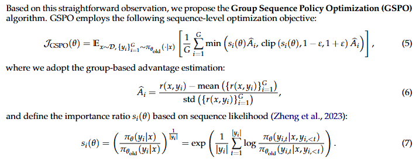

# RLHF-arXiv-2025-Group Sequence Policy Optimization
*论文下载地址：https://arxiv.org/abs/2507.18071v2*

*代码是否开源：未提及*

*分享人：马明晖*

## 一句话总结内容
> 提出GSPO，以序列级似然为重要性比率并在序列级进行裁剪与优化，显著提升LLM（尤其是MoE）在RL训练中的稳定性与效率，已用于Qwen3。

## 一句话总结创新贡献
> 从单位一致性出发，将重要性采样与奖励统一到序列级，用长度归一化的序列似然比进行裁剪与优化，根除GRPO的高方差与不稳定。

## 举一个例子说明这篇文章的创新点
> GSPO以序列级重要性比率 si(θ)=[πθ(y|x)/πθold(y|x)]^(1/|y|) 替代逐token比率，并仅在序列级执行clip与优化；优势在同一query下做多响应标准化以获得序列级优势；提出GSPO-token变体：在保持与GSPO数值等价的序列级权重与clip条件下，允许逐token自定义优势（通过对序列比率仅前向缩放并停止梯度）。

## 公式

**工作流描述**：
> 1) 用旧策略 πθold 为每个query生成G个响应；2) 通过验证器打分，并在同一query内进行均值/方差标准化得到序列级优势；3) 计算长度归一化的序列似然比 si(θ)，在序列级进行clip；4) 以等权重逐token对数似然梯度、配合序列权重与优势作为系数进行更新；5) 可选：用GSPO-token在不改变序列权重与clip条件的前提下，为不同token设置差异化优势；6) 训练可直接复用推理引擎返回的序列似然，减少重算与系统复杂度。

## 本文挑战及已有工作不足
> 1. 大batch切分为mini-batch引入离策略偏移，需要稳健的离策略校正与裁剪
> 2. MoE专家激活波动导致逐token似然比剧烈变化，训练难以收敛
> 3. PPO依赖价值模型，显存与计算开销大，且长序列与复杂任务下的价值估计不稳
> 4. GRPO在逐token上施加重要性比率，单样本权重难以校正分布偏移，方差随长度累积并被clip放大，易致模型坍塌

## 印象最深刻的点
> 1. 已支撑Qwen3系列性能提升，体现工程可落地性
> 2. 长度归一化的序列比率提供统一尺度并显著降低方差
> 3. 在MoE模型上无需Routing Replay即可稳定收敛，显著简化RL训练与开销
> 4. 在相同计算与查询成本下，训练奖励及AIME’24、LiveCodeBench、CodeForces等指标优于GRPO

## 对我们的启发
> 1. 将优化与奖励统一到序列级可显著降低噪声并提升稳定性
> 2. 离策略校正需与奖励的积分单位一致，应在序列级完成重要性采样与优化
> 3. 基础设施上复用推理引擎的序列似然可降低重算与系统耦合
> 4. 长度归一化控制序列似然比尺度，避免由少量token变化引发比率剧烈波动

## Idea是否好想
> 作者指出GRPO的核心失配在于单位不一致：奖励以序列为单位，而重要性比率在token级且每token仅一条样本，离策略校正失效并带来随长度累积的高方差，clip机制进一步放大不稳定；MoE路由变化又使逐token比率更加动荡。GSPO改为长度归一化的序列级重要性比率，并在序列级clip，使同一序列内的对数似然梯度按token等权叠加，从而降低方差、稳定训练并提高样本效率。实验表明即便剪裁比例更高，GSPO仍收敛更快、下游表现更好，且在MoE上无需Routing Replay即可稳定训练，验证了序列级校正与优化的一致性优势。

## 是否有开创性
> 相较PPO：无需价值模型，显著降低显存/计算成本并避免价值估计偏差；相较GRPO：采用序列级、长度归一化的似然比作为重要性比率并在序列级clip，使序列内部梯度对token等权，消除逐token权重波动；提出GSPO-token，在保持序列权重与clip一致的前提下支持逐token优势定制；在工程上可直接使用推理引擎的序列似然，简化RL流水线。

## 是否属于热点
> 大模型RL的稳定性与扩展性、MoE训练稳健化、序列级目标与重要性采样、无需价值模型的高效RL、Qwen3能力提升

## 其他需要补充的点（可选）
> 1. 采用将大rollout批量切分为多个mini-batch的离策略设置，强调clip的必要性
> 2. 利用序列似然的稳健性对冲MoE路由波动引发的逐token不稳定
> 3. GSPO与GRPO的clip范围数量级不同，源于比率定义差异与长度归一化

## 与其他论文的关联（可选）
> 1. 与Click（Zheng et al., 2023）：借鉴序列似然在对比/优化中的作用，用于定义序列级重要性比率以实现稳健离策略校正
> 2. 与GRPO（Shao et al., 2024）：指出其逐token比率的离策略校正失效与不稳根源，GSPO改用序列级、长度归一化的比率并在序列级裁剪与优化
> 3. 与PPO（Schulman et al., 2017）：GSPO摒弃价值模型与逐token比率，采用序列级比率与clip以降方差并简化系统

## 还有哪些不足的地方（未来工作）
> 1. 自适应或学习型clip区间选择，进一步降低方差并提升样本效率
> 2. 系统研究不同奖励模型与多轮对话场景下的GSPO-token优势分配策略与稳定性
> 3. 更深入的方差分析与收敛性证明，尤其刻画对MoE路由波动的鲁棒性
> 4. 将GSPO扩展至多模态、工具使用与长上下文任务，验证序列级校正的通用性
