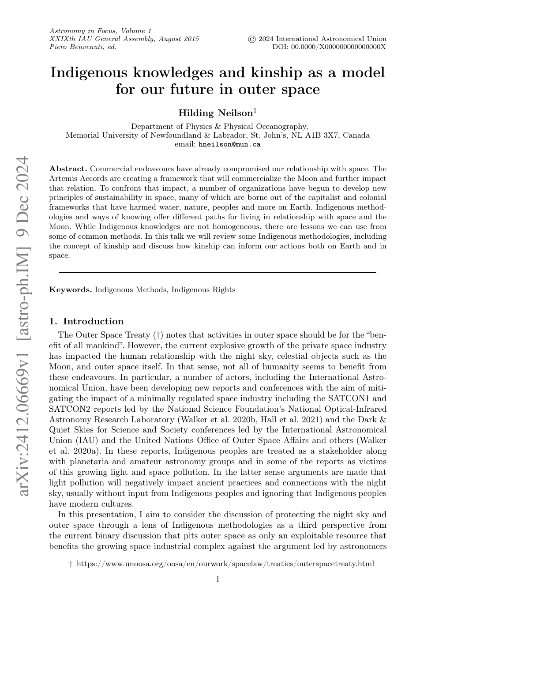

# WorldModel-arxiv-2024-GAIA

*论文下载地址（可选）：[https://arxiv.org/abs/2412.06669]()*

*代码是否开源：否*

*分享人：*

## 一句话总结内容
> 本文探讨了原住民知识体系（Indigenous knowledges）中的"kinship"（亲缘关系）概念，将其作为理解和规划人类与太空关系的伦理框架，倡导在太空探索中采用更具责任感和关系性的方法。

## 一句话总结创新贡献
> 首次将原住民知识中的"kinship"概念系统性地引入天文学与太空探索的讨论，提出以责任、互惠和关系网络为核心的太空伦理模型。

## 框架图
> 
>
> **框架工作流描述**：本文为纯文本论文，无技术框架图。上图为论文首页（title page），展示了论文标题、作者团队及发表信息。

## 本文挑战及已有工作不足
> - 当前太空探索的叙事和实践仍以西方科技主导，缺乏对原住民视角的系统性纳入
> - 现有的太空伦理讨论较少触及"关系性"（relationality）和"互惠性"（reciprocity）这些在原住民哲学中核心的概念
> - 天文学研究中对"homeland"概念的处理往往忽视了原住民与土地、海洋、天空的历史和文化联系

## 印象最深刻的点
> 作者提出"kin"（亲人）的概念可以延伸到非人类存在者（土地、海洋、星空），并以此构建对太空探索的责任伦理——这一观点挑战了传统以人类为中心的外太空法律和伦理框架。

## 对我们的启发
> 虽然本文主题为天文学与原住民知识，但其"kinship-based responsibility"的框架对于**说服对话**和**世界模型**研究具有潜在启发：
> - **世界模型中的关系推理**：将实体间关系建模为"kin-like"的关系网络，而非简单的工具性交互
> - **对话系统中的责任感知**：在对话代理中引入对"对话对象"的"亲缘感"，可能提升共情和说服效果
> - **伦理决策**：世界模型在进行决策推理时可借鉴"互惠性"原则，增加对行动后果的关系性考量

## Idea是否好想
> 较为创新，但可延伸：核心idea是"kinship as a model for space ethics"，本身是跨学科洞见，结合AI领域有一定难度，但核心类比清晰易懂。主要挑战在于如何将"kinship"这种文化/哲学概念操作化为可计算的形式。

## 是否有开创性
> 在天文学+原住民知识交叉领域有开创性；在AI/世界模型领域则属于类比性应用，并非方法上的首创。

## 是否属于Vision
> 否。本文属天文学哲学/伦理研究，不直接涉及计算机视觉或视觉推理。

## 是否属于热点
> 否。"原住民知识与太空伦理"并非AI/ML领域的热点。但"World Models + Ethics"和"AI for Science"方向有一定热度，可与这些热点进行关联。

## 其他需要补充的点（可选）
> - 本文的GAIA指的是国际天文学联合会（IAU）大会（General Assembly），而非欧洲航天局的GAIA卫星项目或General AI Agent
> - 论文仅有7页，无技术框架图和实验部分，属于观点/立场文章
> - 作者Neilson是原住民天文学家（混合Mi'kmaw血统），其个人身份和研究视角深刻影响了论文的论证

## 与其他论文的关联（可选）
> - 与讨论"AI伦理"和"关系性AI"（Relational AI）的研究有潜在关联
> - 可与"World Models中的社会规范建模"相关工作对照阅读
> - "kinship"概念与"心理理论"（Theory of Mind）在关系建模上有相似之处，但出发点不同
